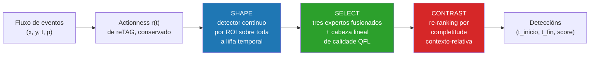

<div align="center">

# CoTAD — dos picos de actividade ás accións completas en fluxos de eventos

**Detección temporal de accións sobre cámaras de eventos, construída enriba dun backbone reTAG conxelado.**

[](https://www.python.org/)
[](https://pytorch.org/)
[](https://developer.nvidia.com/cuda-toolkit)
[](LICENSE)
[-8A2BE2)](https://arxiv.org/abs/2312.03799)
[](#resultados)
[](#tests)
[](#documentación-do-código)

[Visión xeral](#visión-xeral) · [Resultados](#resultados) · [Método](#método) · [Instalación](#instalación) · [Reproducir](#reproducir-os-resultados) · [Estrutura](#estrutura-do-repositorio) · [Stack](#stack)


</div>

---

## Visión xeral

Este repositorio detecta o **Ecstatic Display** —o ritual de cortexo do pingüín barbixo— en gravacións
dunha colonia antártica feitas cunha cámara de eventos. Parte de [reTAG](https://arxiv.org/abs/2312.03799)
(Hamann et al., CVPR 2024) e reconstrúe o detector arredor del.

reTAG puntúa un instante por **canta** actividade ten. Iso responde «móvese algo?», pero non «é este
movemento a acción, e onde empeza e onde remata?». **CoTAD conserva só o actionness de reTAG e o seu
encoder conxelado, e substitúe todo o demais** por un detector de tres etapas que dá forma aos
candidatos desde a liña temporal continua, selecciónaos cunha cabeza de calidade aprendida e
puntúaos contra o seu propio contexto temporal.

O backbone non se reentrena nunca. Toda a ganancia vén do que se construíu arredor del.

| | |
| --- | --- |
| **Tarefa** | Detección temporal de accións (TAD) sobre fluxos de eventos |
| **Entrada** | `E = {(x, y, t, p)}` — eventos de cambio de brillo dunha DAVIS346 a 346×260 px |
| **Dataset** | EventPenguins: 24 gravacións anotadas de 10 min, 16 nidos, 525 instancias ED ≥2 s |
| **Métrica** | mAP media sobre tIoU ∈ {0,1; 0,3; 0,5; 0,7} |
| **Resultado** | **0,7776 de mAP en test**, fronte a 0,5780 do baseline reTAG reproducido |
| **Tamén avaliado en** | THUMOS14-E — THUMOS14 convertido a eventos con v2e, as vinte clases |

---

## Resultados

### Resultado principal

| Fase | Arquitectura | mAP test | Δ vs. baseline |
| --- | --- | ---: | ---: |
| 0 | Baseline reTAG, reproducido | 0,5780 | — |
| 1 | Descritores de propostas (λ adaptativo, compacidade, ruído, prototipo ED, periodicidade) | 0,5879 | +0,99 pp |
| 2 | Post-procesado (Soft-NMS, TTA, temperature scaling, corrección de `merge_proposals`) | 0,6781 | +10,01 pp |
| 3 | Cabeza de calidade sobre o lattice, GroupDRO, CV disxunta por gravación | 0,7381 | +16,01 pp |
| 4 | Cabeza densa por proposta (TemporalMaxer-lite) e voting de fronteiras | 0,7549 | +17,69 pp |
| 5 | **Detector continuo por ROI, tres expertos, completitude, QFL** | **0,7776** | **+19,96 pp** |

Cifras publicadas por reTAG sobre o mesmo dataset: 0,58 de mAP con time maps, 0,55 con
R3D + ActionFormer, 0,93 para un clasificador perfecto sobre as súas propias propostas.

### De onde vén a ganancia

| Compoñente | Vale |
| --- | ---: |
| Cabeza de calidade sobre o lattice de propostas | +4,48 pp |
| Soft-NMS | +3,97 pp |
| Completitude contexto-relativa | +1,48 pp |
| Cabeza lineal QFL | +0,03 pp |

A completitude é a novidade algorítmica, non a palanca máis grande, e esta táboa dío a propósito:
puntuar unha proposta pola actividade **interior** custa 2,18 pp, mentres que restarlle o contexto
que a rodea engade 1,48 pp.

### Calidade das propostas (average recall)

| Orixe | Propostas en test | AR@20 | AR@30 | AR@50 |
| --- | ---: | ---: | ---: | ---: |
| reTAG, reproducido co pipeline emparellado | 39 924 | 0,1565 | 0,2032 | 0,3237 |
| **Propostas de CoTAD, mesmo pipeline emparellado** | 35 490 | **0,3237** | **0,4065** | **0,5306** |

### Desglose por gravación (test, receita canónica)

| Gravación | mAP | AP@0,5 | AP@0,7 | Deteccións |
| --- | ---: | ---: | ---: | ---: |
| `22-01-06_01-00-00` | 0,8927 | 0,9413 | 0,7048 | 2 172 |
| `22-01-13_09-59-00` | 0,8189 | 0,8471 | 0,5987 | 1 878 |
| `22-01-14_21-58-00` | 0,8535 | 0,7901 | 0,6717 | 1 713 |
| `22-01-15_05-58-00` | 0,4871 | 0,5104 | 0,1268 | 1 887 |
| `22-01-15_11-48-00` | 0,5435 | 0,4994 | 0,3207 | 2 757 |

Todo o déficit está en dúas sesións do mesmo día. Tres gravacións superan 0,81.

### Dominio cruzado: THUMOS14-E

THUMOS14 convertido a eventos con v2e, para que reTAG teña unha entrada válida e as dúas ramas corran
sobre os mesmos 413 ficheiros. Co protocolo publicado por reTAG (AR@20/30/50, media en catro limiares
de tIoU), CoTAD mellora **17 das vinte clases e empata tres**; a macro AR@50 pasa de `0,0068` a
`0,0186`. Isto valida o xerador de propostas fóra do seu dominio —non CoTAD end-to-end, nin a
completitude.

### Notas honestas sobre o protocolo

Dúas cautelas acompañan estes números:

- **O split de test consultouse adaptativamente durante meses.** Toda cifra de test é un *máximo
  observado*, non unha estimación cega. A cifra defendible de cross-validation, con folds disxuntos
  por gravación que nunca ven unha sesión de test, é **0,842171** —e non é comparable coa de test.
- **O `0,777803` non existe.** Un push anterior reportouno; unha auditoría completa dos artefactos
  non conseguiu reproducilo. O máximo verificado en test é **`0,777555`**.

O achado metodolóxico dese push vale máis que a súa cifra: 18 hipóteses consecutivas, cada unha
seleccionada baixo cross-validation disxunta por gravación, valeron **0,025 pp** xuntas en test.
Cando o cambio de dominio é de sesión e non de dataset, cross-validar sobre as sesións dispoñibles
non o mide.

---

## Método

CoTAD conserva o actionness de reTAG e o seu encoder conxelado, e reconstrúe o detector en tres etapas.



**SHAPE.** En vez de limiarizar o sinal de actionness en propostas illadas, un detector ao estilo
TemporalMaxer ([`src/temporalmaxer_continuous.py`](src/temporalmaxer_continuous.py)) consome a liña
temporal `[T, D]` completa do ROI, aprende de cada punto de fondo e decodifica deteccións en cada
nivel dunha pirámide de max-pooling. Cada nivel ocúpase dunha banda de duración, así que os displays
curtos e longos deixan de competir.

**SELECT.** Tres expertos —un TemporalMaxer sobre características do clasificador, outro sobre
características de eventos e un experto local de propostas— fusiónanse por ranking percentil global e
repuntúanse cunha cabeza QFL dunha soa capa sobre 17 descritores por proposta, cross-fitted por fold.

```
TemporalMaxer ATSN         peso 0,20
+ TemporalMaxer eventos    peso 0,40
+ proposta local QFL       peso 0,40
+ ranking percentil global, top-k 100 por experto e ROI
+ Soft-NMS gaussiano sigma 0,50, máximo 200 deteccións por ROI, duración mínima 2 s
```

O ámbito do ranking importa máis do que parece: o ranking percentil global dá 0,842171 en
cross-validation, por gravación 0,682657 e por ROI 0,411505.

**CONTRAST.** Unha proposta puntúase contra o que a rodea, non polo seu interior:

```
completitude = media(actionness dentro)
             − 0,5 · (media(contexto esquerdo) + media(contexto dereito))
score final  = 0,75 · ranking orixinal + 0,25 · ranking de completitude
```

co contexto fixado en media duración da proposta a cada lado.

---

## Estrutura do repositorio

```
.
├── src/                          # implementación estable — o sistema en si
│   ├── proposals.py              # etapa 1: propostas reTAG + descritores da fase 1
│   ├── classification.py         # etapa 2: puntuación ATSN, calibración, Soft-NMS
│   ├── temporalmaxer_continuous.py   # o detector continuo de CoTAD (arquitectura final)
│   ├── temporalmaxer_lite.py     # o seu predecesor por proposta
│   ├── augmented_tsn.py          # o clasificador ATSN
│   ├── evaluation.py             # mAP e average recall ao estilo ActivityNet
│   ├── prototype.py              # prototipo espacial ED e similitude por bin
│   ├── bsp.py                    # tarefa pretexto sensible a fronteiras
│   ├── rank_sort_loss.py         # Rank & Sort loss
│   ├── tespec_encoder.py         # encoder recorrente TESPEC conxelado
│   ├── tism_encoder.py           # encoder TISM de dúas vistas, conxelado
│   └── utils/                    # carga de config, NMS temporal, comprobacións
├── scripts/                      # puntos de entrada
│   ├── preprocess.py             # gravacións cruas → data/preprocessed.h5
│   ├── inference.py              # pipeline completo, reporta mAP
│   └── evaluation.py             # avalía un ficheiro de predicións existente
├── dev/                          # 227 scripts de experimentación — ver dev/README.md
├── config/
│   ├── exp/inference.yaml        # a configuración do pipeline
│   └── annotations/              # anotacións, info de gravacións, ROIs por nido
├── data/                         # datasets (ignorados por git)
└── models/                       # pesos preadestrados (ignorados por git)
```

Todo o reproducible vive en dous sitios: [`src/`](src/) ten o sistema e [`dev/`](dev/README.md) ten
todos os experimentos que se correron para chegar aquí —incluídos os que fallaron—, indexados e
resumidos en [`dev/README.md`](dev/README.md).

---

## Stack

| Capa | Tecnoloxía | Versión | Para que |
| --- | --- | --- | --- |
| Linguaxe | Python | 3.8 | — |
| Aprendizaxe profunda | PyTorch | 2.4+ (2.7 no servidor de experimentos) | detectores, cabezas, perdas |
| Modelos de visión | torchvision, timm | 0.20, 1.0.20 | backbone ResNet-18, Swin-T para TESPEC |
| Arrays | NumPy | 1.24 | procesado de eventos, métricas |
| Táboas | pandas | 1.5 | propostas, folds, resultados |
| Almacenamento | h5py | 3.7 | `preprocessed.h5`, fluxos de eventos por ROI |
| Configuración | PyYAML, absl-py | 6.0, 2.3 | configs de experimentos, flags, logging |
| Paralelismo | joblib, multiprocessing | 1.4 | métricas por etiqueta, propostas por gravación |
| Imaxe | Pillow | 10.4 | renderizado de time surfaces |
| Gráficas | matplotlib | 3.7 | figuras de diagnóstico |
| Progreso | tqdm | 4.67 | bucles longos |
| Tests | unittest | stdlib | 40 módulos de test |
| Eventos | [v2e](https://github.com/SensorsINI/v2e) | externo | conversión THUMOS14 → THUMOS14-E |
| Rama de comparación | [ActionFormer](https://github.com/happyharrycn/actionformer_release) | externo, espérase como `libs/` | baseline de dominio cruzado |
| Hardware | NVIDIA RTX 5090, 32 GB de VRAM, CUDA 12.8 | — | adestramento e avaliación |

Os dous repositorios externos **non están incluídos**. `v2e` só fai falla para reconstruír THUMOS14-E
e ActionFormer só para correr a rama de comparación; o resto do pipeline funciona sen ningún dos dous.

---

## Instalación

```bash
conda create --name eventpenguins python=3.8
conda activate eventpenguins

# instala PyTorch para a túa versión de CUDA primeiro — ver pytorch.org
pip install torch torchvision

pip install -r requirements.txt
```

## Preparación dos datos

Descarga as gravacións de EventPenguins do
[proxecto base](https://github.com/tub-rip/event_penguins) en `data/` e logo:

```bash
mkdir -p data models
python scripts/preprocess.py \
    --data_root data/EventPenguins \
    --output_dir data \
    --recording_info_path config/annotations/recording_info.csv
```

Isto recorta os eventos aos nidos anotados, marca cada gravación co seu split e escribe un único
`data/preprocessed.h5` organizado por gravación e ROI. Os pesos ATSN preadestrados van en `models/` e
fan falla para a etapa de clasificación.

## Reproducir os resultados

```bash
# o pipeline completo de dúas etapas, reportando mAP
python scripts/inference.py --config config/exp/inference.yaml --verbose

# avaliar un ficheiro de predicións existente
python scripts/evaluation.py --prediction_path output/inference/run/predictions.json
```

O baseline é o que sae con todos os interruptores `use_*` de
[`config/exp/inference.yaml`](config/exp/inference.yaml) en `false`. Activándoos reprodúcense os
descritores da fase 1.

As fases posteriores córrense desde `dev/`, sempre desde a raíz do repositorio:

```bash
export PYTHONPATH=.:dev

# fase 1: variantes de propostas e a súa busca de hiperparámetros
python dev/tune_proposals.py --help
python dev/eval_proposals.py --help

# fase 5: o detector continuo e a receita canónica de fusión
python dev/train_temporalmaxer_continuous.py --help
python dev/eval_continuous_multi_rep_fusion_cv.py --help

# a cabeza lineal QFL: cross-fitted e logo avaliada unha soa vez en test conxelado
python dev/eval_actionness_quality_head_cv.py --help
python dev/eval_actionness_quality_head_test.py --help

# avaliación de dominio cruzado en THUMOS14-E
python dev/prepare_thumos14_event_corpus.py --help
python dev/run_thumos14e_full_pipeline.py --help
```

O sufixo `_cv` significa cross-validation disxunta por gravación, onde se seleccionan hipóteses. O
sufixo `_test` significa o split de test conxelado, onde se reportan resultados. Ningún script `_cv`
le test. [`dev/README.md`](dev/README.md) indexa os 227 scripts por función.

## Tests

40 módulos de `unittest`, executados desde a raíz do repositorio:

```bash
conda activate eventpenguins
export PYTHONPATH=.:dev

# un módulo
python -m unittest dev.test_rank_sort_loss

# todos
for t in dev/test_*.py; do python -m unittest "dev.$(basename "$t" .py)"; done
```

A maior parte da suite garda invariantes de protocolo máis ca cifras: que un fold non poida absorber
un vídeo de test, que unha calibración se axuste só sobre datos de adestramento, que un manifesto teña
os 212 vídeos canónicos de test de THUMOS14. Ese tipo de erro non se manifesta como un fallo, senón
como un número bo de máis.

## Documentación do código

Cada módulo, clase pública e función pública leva un docstring en estilo Google, en inglés. En vez de
repetir a sinatura, os docstrings din para que serve un compoñente e por que existe: unha grella de
limiares documéntase contra a grella fixa que substitúe, e unha perda contra o modo de fallo que
responde.

```bash
python -c "import src.proposals; help(src.proposals.get_periodicity_indicator)"
```

---

## Relación co proxecto base

Este repositorio parte de [tub-rip/event_penguins](https://github.com/tub-rip/event_penguins), a
release oficial de reTAG. O que se herda: a estrutura do dataset, o script de preprocesado, o
clasificador ATSN e os seus pesos, e o protocolo de avaliación. O que é novo: os descritores de
propostas da fase 1, toda a etapa de post-procesado, o detector continuo, a receita de fusión, a
cabeza de calidade, a completitude contexto-relativa e o corpus de dominio cruzado THUMOS14-E.

Unha corrección merece nome propio: `merge_proposals` nunca engadía o seu último grupo, e perdía en
silencio a última proposta de cada ROI. Corrixilo forma parte dos +10,01 pp da fase 2.

## Cita

Se usas este traballo, cita o baseline sobre o que se constrúe:

```bibtex
@inproceedings{hamann2024low,
  title     = {Low-power Continuous Remote Behavioral Localization with Event Cameras},
  author    = {Hamann, Friedhelm and Ghosh, Suman and Juarez Martinez, Ignacio and
               Hart, Tom and Kacelnik, Alex and Gallego, Guillermo},
  booktitle = {Proceedings of the IEEE/CVF Conference on Computer Vision and Pattern Recognition (CVPR)},
  year      = {2024}
}
```

## Contexto

Feito por Pablo Seijo como Traballo de Fin de Grao en Enxeñaría Informática na Universidade de
Santiago de Compostela (USC-ETSE), dirixido por Xosé Manuel Pardo López e codirixido por Antonio José
Rodríguez Sánchez. O TFG está defendido; o traballo continúa como artigo.

## Licenza

MIT — ver [LICENSE](LICENSE). Consérvase o copyright orixinal do proxecto base.

---

<div align="center">

**[English version →](README.md)**

</div>
