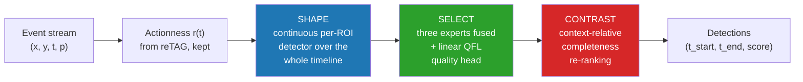

<div align="center">

# CoTAD — From Activity Peaks to Complete Actions in Event Streams

**Temporal action detection on event cameras, built on top of a frozen reTAG backbone.**

[](https://www.python.org/)
[](https://pytorch.org/)
[](https://developer.nvidia.com/cuda-toolkit)
[](LICENSE)
[-8A2BE2)](https://arxiv.org/abs/2312.03799)
[](#results)
[](#tests)
[](#code-documentation)

[Overview](#overview) · [Results](#results) · [Method](#method) · [Install](#installation) · [Reproduce](#reproducing-the-results) · [Layout](#repository-layout) · [Stack](#stack)


</div>

---

## Overview

This repository detects the **Ecstatic Display** — the courtship ritual of the chinstrap penguin — in
event-camera recordings of an Antarctic colony. It starts from [reTAG](https://arxiv.org/abs/2312.03799)
(Hamann et al., CVPR 2024) and rebuilds the detector around it.

reTAG scores a moment by *how much* activity it holds. That answers "is something moving?" but not
"is this motion the action, and where does it begin and end?". **CoTAD keeps only reTAG's actionness
signal and its frozen encoder, and replaces everything else** with a three-stage detector that shapes
candidates from the continuous timeline, selects them with a learned quality head, and scores them
against their own temporal context.

The backbone is never retrained. Every gain reported here comes from what was built around it.

| | |
| --- | --- |
| **Task** | Temporal action detection (TAD) on event streams |
| **Input** | `E = {(x, y, t, p)}` — brightness-change events from a DAVIS346 at 346×260 px |
| **Dataset** | EventPenguins: 24 annotated 10-minute recordings, 16 nests, 525 ED instances ≥2 s |
| **Metric** | mAP averaged over tIoU ∈ {0.1, 0.3, 0.5, 0.7} |
| **Result** | **0.7776 test mAP**, up from 0.5780 for the reproduced reTAG baseline |
| **Also evaluated on** | THUMOS14-E — THUMOS14 converted to events with v2e, all 20 classes |

---

## Results

### Main result

| Stage | Architecture | Test mAP | Δ vs. baseline |
| --- | --- | ---: | ---: |
| 0 | reTAG baseline, reproduced | 0.5780 | — |
| 1 | Proposal descriptors (adaptive λ, compactness, noise, ED prototype, periodicity) | 0.5879 | +0.99 pp |
| 2 | Post-processing (Soft-NMS, TTA, temperature scaling, `merge_proposals` fix) | 0.6781 | +10.01 pp |
| 3 | Quality head over a proposal lattice, GroupDRO, recording-disjoint CV | 0.7381 | +16.01 pp |
| 4 | Dense per-proposal head (TemporalMaxer-lite) and boundary voting | 0.7549 | +17.69 pp |
| 5 | **Continuous per-ROI detector, three experts, completeness, QFL** | **0.7776** | **+19.96 pp** |

Reference numbers published by reTAG on the same dataset: 0.58 mAP with time maps, 0.55 with
R3D + ActionFormer, 0.93 for a perfect classifier over its own proposals.

### Where the gains come from

| Component | Worth |
| --- | ---: |
| Quality head over the proposal lattice | +4.48 pp |
| Soft-NMS | +3.97 pp |
| Context-relative completeness | +1.48 pp |
| Linear QFL head | +0.03 pp |

Completeness is the algorithmic novelty, not the largest lever, and this table says so on purpose:
scoring a proposal by the activity *inside* it costs 2.18 pp, while subtracting its surrounding
context adds 1.48 pp.

### Proposal quality (average recall)

| Source | Test proposals | AR@20 | AR@30 | AR@50 |
| --- | ---: | ---: | ---: | ---: |
| reTAG, reproduced through the paired pipeline | 39,924 | 0.1565 | 0.2032 | 0.3237 |
| **CoTAD proposals, same paired pipeline** | 35,490 | **0.3237** | **0.4065** | **0.5306** |

### Per-recording breakdown (test, canonical recipe)

| Recording | mAP | AP@0.5 | AP@0.7 | Detections |
| --- | ---: | ---: | ---: | ---: |
| `22-01-06_01-00-00` | 0.8927 | 0.9413 | 0.7048 | 2,172 |
| `22-01-13_09-59-00` | 0.8189 | 0.8471 | 0.5987 | 1,878 |
| `22-01-14_21-58-00` | 0.8535 | 0.7901 | 0.6717 | 1,713 |
| `22-01-15_05-58-00` | 0.4871 | 0.5104 | 0.1268 | 1,887 |
| `22-01-15_11-48-00` | 0.5435 | 0.4994 | 0.3207 | 2,757 |

The whole deficit sits in two sessions of a single day. Three recordings clear 0.81.

### Cross-domain: THUMOS14-E

THUMOS14 converted to events with v2e, so that reTAG has a valid input and both arms run over the
same 413 files. Under reTAG's own protocol (AR@20/30/50 averaged over four tIoU thresholds), CoTAD
improves **17 of the 20 classes and ties 3**; macro AR@50 goes from `0.0068` to `0.0186`. This
validates the proposal generator across domains — not CoTAD end to end, and not completeness.

### Honest protocol notes

Two caveats travel with these numbers:

- **The test split was consulted adaptively over months.** Every test figure is an *observed
  maximum*, not a blind estimate. The defensible cross-validated number, from recording-disjoint
  folds that never see a test session, is **0.842171** — and it is not comparable with the test one.
- **`0.777803` does not exist.** An earlier push reported it; a full audit of the artifacts could not
  reproduce it. The highest verified test result is **`0.777555`**.

The methodological finding of that push is worth more than its score: 18 consecutive hypotheses,
each selected under recording-disjoint cross-validation, were worth **0.025 pp** together on test.
When the domain shift is between sessions rather than between datasets, cross-validating over the
available sessions does not measure it.

---

## Method

CoTAD keeps reTAG's actionness and its frozen encoder, and rebuilds the detector as three stages.



**SHAPE.** Instead of thresholding the actionness signal into isolated proposals, a TemporalMaxer-style
detector ([`src/temporalmaxer_continuous.py`](src/temporalmaxer_continuous.py)) consumes the complete
`[T, D]` ROI timeline, learns from every background point, and decodes detections at every level of a
max-pooling pyramid. Each level owns a duration band, so short and long displays stop competing.

**SELECT.** Three experts — a TemporalMaxer over classifier features, a TemporalMaxer over event
features, and a local proposal expert — are fused by global percentile ranking, then re-scored by a
single-layer QFL head over 17 per-proposal descriptors, cross-fitted per fold.

```
TemporalMaxer ATSN        weight 0.20
+ TemporalMaxer events    weight 0.40
+ local QFL proposal      weight 0.40
+ global percentile ranking, top-k 100 per expert and ROI
+ gaussian Soft-NMS, sigma 0.50, max 200 detections per ROI, min duration 2 s
```

Ranking scope matters more than it looks: global percentile ranking scores 0.842171 in
cross-validation, per-recording 0.682657 and per-ROI 0.411505.

**CONTRAST.** A proposal is scored against its own surroundings rather than by its interior:

```
completeness = mean(actionness inside)
             − 0.5 · (mean(left context) + mean(right context))
final score  = 0.75 · original ranking + 0.25 · completeness ranking
```

with the context window set to half the proposal duration on each side.

---

## Repository layout

```
.
├── src/                          # stable implementation — the system itself
│   ├── proposals.py              # stage 1: reTAG proposals + phase-1 descriptors
│   ├── classification.py         # stage 2: ATSN scoring, calibration, Soft-NMS
│   ├── temporalmaxer_continuous.py   # the CoTAD continuous detector (final architecture)
│   ├── temporalmaxer_lite.py     # its proposal-local predecessor
│   ├── augmented_tsn.py          # the ATSN classifier
│   ├── evaluation.py             # ActivityNet-style mAP and average recall
│   ├── prototype.py              # ED spatial prototype and per-bin similarity
│   ├── bsp.py                    # boundary-sensitive pretext task
│   ├── rank_sort_loss.py         # Rank & Sort loss
│   ├── tespec_encoder.py         # frozen TESPEC recurrent event encoder
│   ├── tism_encoder.py           # frozen dual-view TISM encoder
│   └── utils/                    # config loading, temporal NMS, filesystem guards
├── scripts/                      # entry points
│   ├── preprocess.py             # raw recordings → data/preprocessed.h5
│   ├── inference.py              # full pipeline end to end, reports mAP
│   └── evaluation.py             # score an existing prediction file
├── dev/                          # 227 experiment scripts — see dev/README.md
├── config/
│   ├── exp/inference.yaml        # the pipeline configuration
│   └── annotations/              # annotations, recording info, per-nest ROIs
├── data/                         # datasets (git-ignored)
└── models/                       # pretrained weights (git-ignored)
```

Everything reproducible lives in two places: [`src/`](src/) holds the system, and
[`dev/`](dev/README.md) holds every experiment that was run to get there — including the ones that
failed, indexed and summarised in [`dev/README.md`](dev/README.md).

---

## Stack

| Layer | Technology | Version | Used for |
| --- | --- | --- | --- |
| Language | Python | 3.8 | — |
| Deep learning | PyTorch | 2.4+ (2.7 on the experiment server) | detectors, heads, losses |
| Vision models | torchvision, timm | 0.20, 1.0.20 | ResNet-18 backbone, Swin-T for TESPEC |
| Arrays | NumPy | 1.24 | event processing, metrics |
| Tables | pandas | 1.5 | proposals, folds, results |
| Storage | h5py | 3.7 | `preprocessed.h5`, per-ROI event streams |
| Config | PyYAML, absl-py | 6.0, 2.3 | experiment configs, flags, logging |
| Parallelism | joblib, multiprocessing | 1.4 | per-label metrics, per-recording proposals |
| Imaging | Pillow | 10.4 | time-surface rendering |
| Plots | matplotlib | 3.7 | diagnostic figures |
| Progress | tqdm | 4.67 | long-running loops |
| Tests | unittest | stdlib | 40 test modules |
| Events | [v2e](https://github.com/SensorsINI/v2e) | external | THUMOS14 → THUMOS14-E conversion |
| Comparison arm | [ActionFormer](https://github.com/happyharrycn/actionformer_release) | external, expected as `libs/` | cross-domain baseline |
| Hardware | NVIDIA RTX 5090, 32 GB VRAM, CUDA 12.8 | — | training and evaluation |

The two external repositories are **not vendored**. `v2e` is only needed to rebuild THUMOS14-E, and
ActionFormer only to run the comparison arm; the rest of the pipeline runs without either.

---

## Installation

```bash
conda create --name eventpenguins python=3.8
conda activate eventpenguins

# install PyTorch for your CUDA version first — see pytorch.org
pip install torch torchvision

pip install -r requirements.txt
```

## Data preparation

Download the EventPenguins recordings from the
[base project](https://github.com/tub-rip/event_penguins) into `data/`, then:

```bash
mkdir -p data models
python scripts/preprocess.py \
    --data_root data/EventPenguins \
    --output_dir data \
    --recording_info_path config/annotations/recording_info.csv
```

This crops the events to the annotated nests, stamps each recording with its split and writes a
single `data/preprocessed.h5` organised by recording and ROI. Pretrained ATSN weights go in
`models/` and are needed for the classification stage.

## Reproducing the results

```bash
# the full two-stage pipeline, end to end, reporting mAP
python scripts/inference.py --config config/exp/inference.yaml --verbose

# score an existing prediction file
python scripts/evaluation.py --prediction_path output/inference/run/predictions.json
```

The baseline is what you get with every `use_*` switch in
[`config/exp/inference.yaml`](config/exp/inference.yaml) left at `false`. Turning them on reproduces
the phase-1 descriptors.

Later phases run from `dev/`, always from the repository root:

```bash
export PYTHONPATH=.:dev

# phase 1: proposal variants and their hyperparameter search
python dev/tune_proposals.py --help
python dev/eval_proposals.py --help

# phase 5: the continuous detector and the canonical fusion recipe
python dev/train_temporalmaxer_continuous.py --help
python dev/eval_continuous_multi_rep_fusion_cv.py --help

# the linear QFL quality head: cross-fitted, then evaluated once on frozen test
python dev/eval_actionness_quality_head_cv.py --help
python dev/eval_actionness_quality_head_test.py --help

# cross-domain evaluation on THUMOS14-E
python dev/prepare_thumos14_event_corpus.py --help
python dev/run_thumos14e_full_pipeline.py --help
```

A `_cv` suffix means recording-disjoint cross-validation, where hypotheses are selected. A `_test`
suffix means the frozen test split, where results are reported. No `_cv` script reads test.
[`dev/README.md`](dev/README.md) indexes all 227 scripts by role.

## Tests

40 `unittest` modules, run from the repository root:

```bash
conda activate eventpenguins
export PYTHONPATH=.:dev

# one module
python -m unittest dev.test_rank_sort_loss

# all of them
for t in dev/test_*.py; do python -m unittest "dev.$(basename "$t" .py)"; done
```

Most of the suite guards protocol invariants rather than numerics — that a fold cannot absorb a test
video, that a calibration is fitted on training data only, that a manifest holds the canonical 212
THUMOS14 test videos. That class of bug does not surface as a failure; it surfaces as a number that
looks too good.

## Code documentation

Every module, public class and public function carries a Google-style docstring, in English. Rather
than restating the signature, docstrings state what a component is for and why it exists — a
threshold grid is documented against the fixed grid it replaces, a loss against the failure mode it
answers.

```bash
python -c "import src.proposals; help(src.proposals.get_periodicity_indicator)"
```

---

## Relation to the base project

This repository starts from [tub-rip/event_penguins](https://github.com/tub-rip/event_penguins), the
official release of reTAG. What is inherited: the dataset layout, the preprocessing script, the ATSN
classifier and its weights, the evaluation protocol. What is new: the phase-1 proposal descriptors,
the entire post-processing stage, the continuous detector, the fusion recipe, the quality head,
context-relative completeness, and the THUMOS14-E cross-domain corpus.

One correctness fix is worth naming: `merge_proposals` never flushed its final group, silently
dropping the last proposal of every ROI. Fixing it is part of the +10.01 pp of phase 2.

## Citation

If you use this work, please cite the baseline it builds on:

```bibtex
@inproceedings{hamann2024low,
  title     = {Low-power Continuous Remote Behavioral Localization with Event Cameras},
  author    = {Hamann, Friedhelm and Ghosh, Suman and Juarez Martinez, Ignacio and
               Hart, Tom and Kacelnik, Alex and Gallego, Guillermo},
  booktitle = {Proceedings of the IEEE/CVF Conference on Computer Vision and Pattern Recognition (CVPR)},
  year      = {2024}
}
```

## Context

Built by Pablo Seijo as a Bachelor's thesis in Computer Engineering at the University of Santiago de
Compostela (USC-ETSE), supervised by Xosé Manuel Pardo López and co-supervised by Antonio José
Rodríguez Sánchez. The thesis has been defended; the work continues as a paper submission.

## License

MIT — see [LICENSE](LICENSE). The original copyright of the base project is preserved.

---

<div align="center">

**[Versión en galego →](README.gl.md)**

</div>
